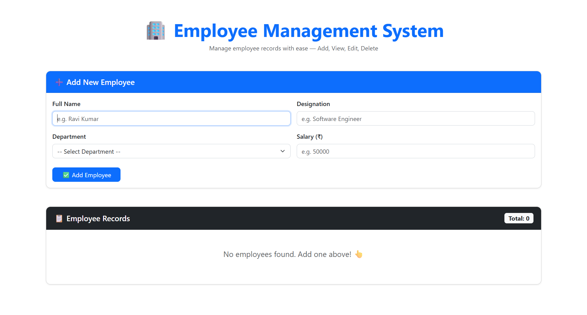
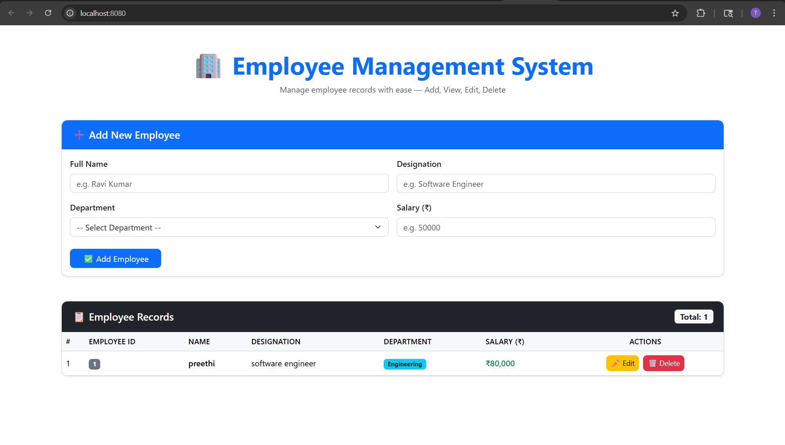
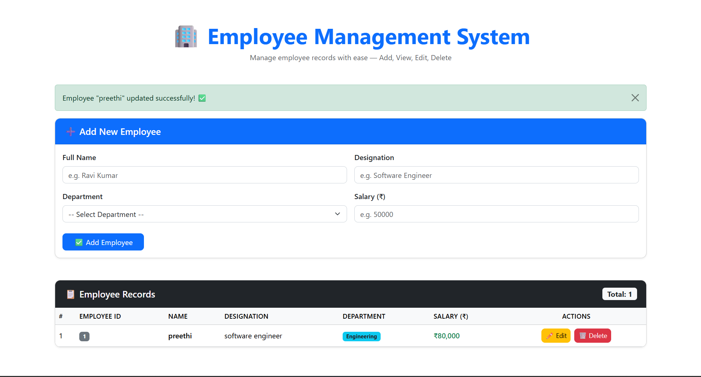
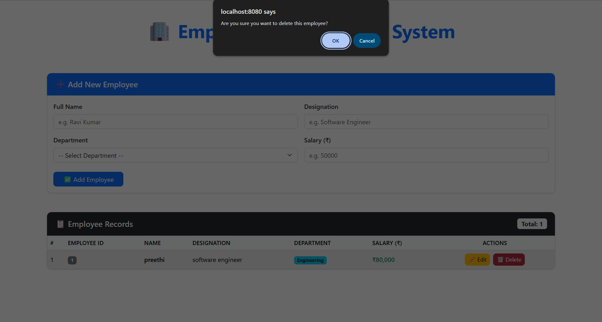

# 🏢 Employee Management System

A responsive CRUD (Create, Read, Update, Delete) web application built using **Vue.js 3**, **Axios**, **Bootstrap 5**, and **MockAPI** for managing employee records efficiently.

---

# 📌 Project Description

The Employee Management System is a frontend web application that allows users to:

- Add employee details
- View employee records
- Update existing employee information
- Delete employee records

The application communicates with a REST API created using **MockAPI.io** and performs HTTP requests using **Axios**.

The user interface is designed using **Bootstrap 5** to provide a clean and responsive experience across devices.

---

# ✨ Features

- ➕ Add New Employees
- 📋 Display Employee Records
- ✏️ Update Employee Details
- 🗑️ Delete Employee Records
- 🔄 Real-time API Integration using Axios
- 📱 Responsive Bootstrap UI
- ⚡ Fast and Lightweight SPA

---

# 🛠️ Technologies Used

| Technology | Purpose |
|------------|---------|
| Vue.js 3 | Frontend Framework |
| Axios | HTTP Requests |
| Bootstrap 5 | Responsive UI |
| MockAPI.io | Mock REST API |
| GitHub Pages | Deployment |

---

# 📁 Project Structure

```text
employee-management/
│
├── public/
│   └── index.html
│
├── src/
│   ├── App.vue
│   ├── main.js
│   │
│   └── components/
│       ├── AddEmployee.vue
│       ├── EmployeeList.vue
│       ├── UpdateEmployee.vue
│       └── DeleteEmployee.vue
│
├── screenshots/
│
├── package.json
├── README.md
└── vue.config.js
```

---

# 🚀 Getting Started

## Step 1: Clone Repository

```bash
git clone https://github.com/PreethiT22/employee-management.git
```

---

## Step 2: Open Project Folder

```bash
cd employee-management
```

---

## Step 3: Install Dependencies

```bash
npm install
```

---

## Step 4: Install Axios and Bootstrap

```bash
npm install axios bootstrap
```

---

## Step 5: Configure MockAPI

Create a MockAPI project from:

```text
https://mockapi.io
```

Create a resource named:

```text
employees
```

Add the following fields:

| Field Name | Type |
|------------|------|
| employeeId | string |
| name | string |
| designation | string |
| department | string |
| salary | number |

Copy your API URL.

Example:

```text
https://69f8c4e0f7044aa0103e75a0.mockapi.io/api/employees
```

Replace the API URL inside all Vue components.

---

# ▶️ Run the Application

```bash
npm run serve
```

Open browser:

```text
http://localhost:8080
```

---

# 📡 API Endpoints

Base URL:

```text
https://69f8c4e0f7044aa0103e75a0.mockapi.io/api/employees
```

| Method | Endpoint | Description |
|--------|----------|-------------|
| GET | /employees | Fetch all employees |
| POST | /employees | Add employee |
| PUT | /employees/:id | Update employee |
| DELETE | /employees/:id | Delete employee |

---

# 🧩 CRUD Operations

## ➕ Create Employee

Uses:

```js
axios.post()
```

Adds a new employee record to MockAPI.

---

## 📋 Read Employees

Uses:

```js
axios.get()
```

Fetches all employee records from API.

---

## ✏️ Update Employee

Uses:

```js
axios.put()
```

Updates employee details using employee ID.

---

## 🗑️ Delete Employee

Uses:

```js
axios.delete()
```

Deletes employee record from API.

---

# 📸 Screenshots

## 📸 Screenshots

### Employee Table

### Add Employee



### Edit Employee


### Delete Employee



# 🌐 Deployment

This project is deployed using GitHub Pages.

## Build Project

```bash
npm run build
```

## Deploy

```bash
npm run deploy
```

Live Demo:

```text
https://PreethiT22.github.io/employee-management/
```

---

# 📚 Concepts Used

- Vue Components
- Vue Lifecycle Hooks
- mounted()
- Reactive Data Binding
- Axios API Integration
- REST API
- Bootstrap Styling
- Async/Await
- CRUD Operations

---

# ❓ Viva Questions

## What is Vue.js?

Vue.js is a progressive JavaScript framework used for building user interfaces and single-page applications.

---

## What is Axios?

Axios is a promise-based HTTP client used to communicate with APIs.

---

## What is CRUD?

CRUD stands for:
- Create
- Read
- Update
- Delete

---

## What is mounted() in Vue?

mounted() is a lifecycle hook that runs after the component is inserted into the DOM.

---

## What is MockAPI?

MockAPI is an online tool used to create fake REST APIs for frontend development and testing.

---

## What is Bootstrap?

Bootstrap is a CSS framework used for responsive web design.

---

# 👩‍💻 Author

## Preethi T

GitHub:
```text
https://github.com/PreethiT22
```

---

# 📄 License

This project is developed for educational purposes as part of the Web Programming Assignment.

---

# ❤️ Acknowledgement

Thanks to:
- Vue.js Documentation
- Axios Documentation
- Bootstrap Documentation
- MockAPI.io

```